> Started a little blog just to get some traffic<br>
> Old folks’ll tell you not to play in traffic, uh<br>
> A million hits and the web crashes, damn
>
> — Kanye West, ["Made in America"](https://youtu.be/9HjooYOAVjw?t=66) (2011)

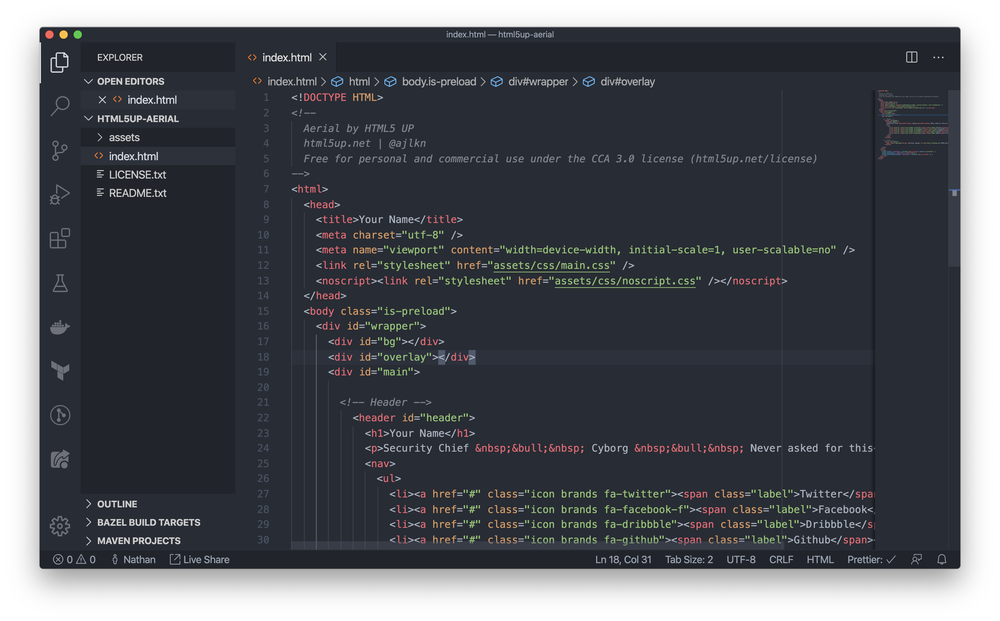

In the last decade, startups have raised [millions](https://techcrunch.com/2010/12/08/breaking-salesforce-buys-heroku-for-212-million-in-cash/) [of](https://techcrunch.com/2013/11/05/twitter-friends-ahead-of-its-public-debut-wednesday-wix-prices-ipo-at-16-50-per-share-with-valuation-near-800m/) [dollars](https://techcrunch.com/2020/03/04/netfily-nabs-53m-series-c-as-micro-services-approach-to-web-development-grows/) on making the experience of launching a new website easier than ever.

At the same time — as it has been for the [past five decades](https://en.wikipedia.org/wiki/Moore%27s_law) — compute power has become cheaper than ever.

One byproduct of this progression is that it's made launching a new website exceedingly easy, and pretty much free:

When I first got started with web development, I had to buy web hosting through GoDaddy or Namecheap (about \$72/year). I'd wait half an hour or so for my account to be created on their server, and in the meantime I'd write HTML code by hand. Then, I'd have to use the [terminal to upload the HTML](https://en.wikipedia.org/wiki/Secure_copy) directly to the server.

Now, I can download a [free HTML5 template](https://html5up.net/), drag and drop my site files onto a web UI, and instantly get a globally available, scalable site for \$0/year. And it's just \$12 more if I want my own domain (like [natecation.com](http://natecation.com)).

That is: there's never been an easier, cheaper, better time to claim one's own little corner of the internet.

Here's how you can get started.

> This tutorial takes about an hour if you follow the instructions from start to finish, and as much as two if you use a different template or want to play around with the layout or styling. This doesn't need to be finished in one sitting, but if you'd like to, make sure to allot enough time to do so.

## Getting Started

Whether you speak English, Spanish, Chinese, or Esperanto, HTML is the one true language of the internet.

Right-click on this page, hit "Inspect" (it might also be "Inspect Element," depending on your browser, and on Safari you'll have to enable the [Develop Menu](https://support.apple.com/guide/safari/use-the-developer-tools-in-the-develop-menu-sfri20948/mac)) and you'll see the soup of `<`, `/` and `>` that the 'net is made out of.

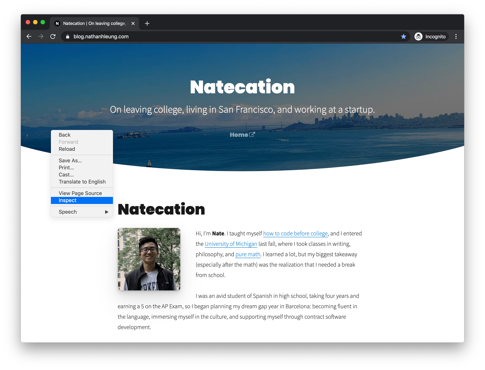

Every website you visit is some permutation of those characters, which means for your personal website you'll need some HTML code of your own.

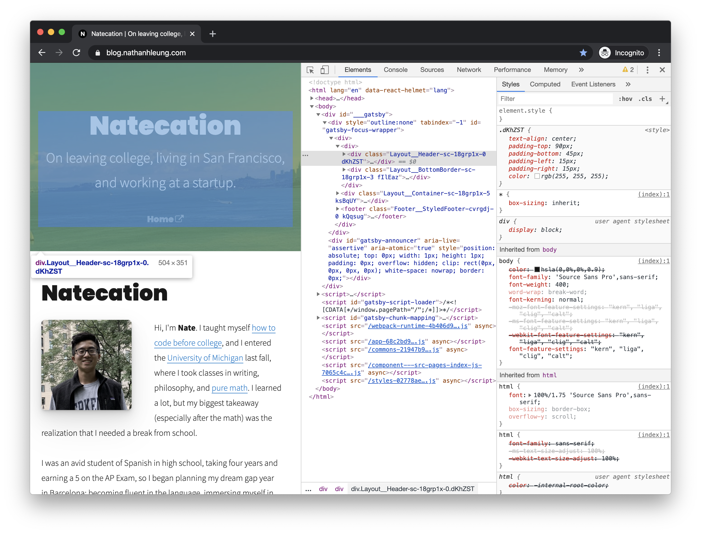

> Already have HTML code you want to upload? Skip to ["Upload to the Internet"](#upload-to-the-internet)

Fortunately, you don't even need to know HTML: there exist many awesome, free templates that are highly customizable even for beginners. One of my favorite sources for these templates is [HTML5 UP](https://html5up.net/).

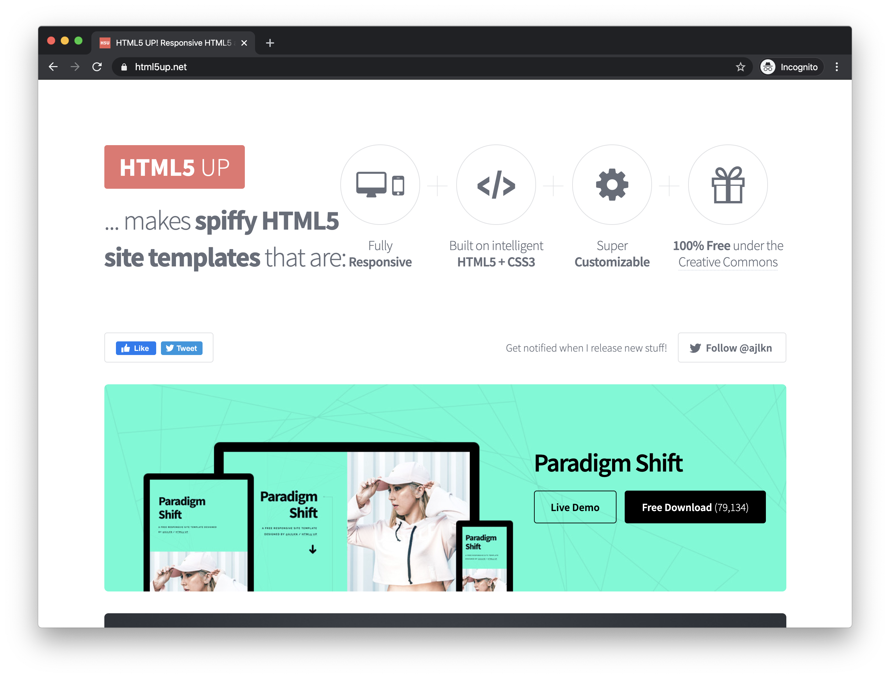

If you have zero prior experience, I recommend downloading ["Aerial"](https://html5up.net/aerial) (about halfway down the page) — it's a super-simple, one-page template perfect for a personal website.

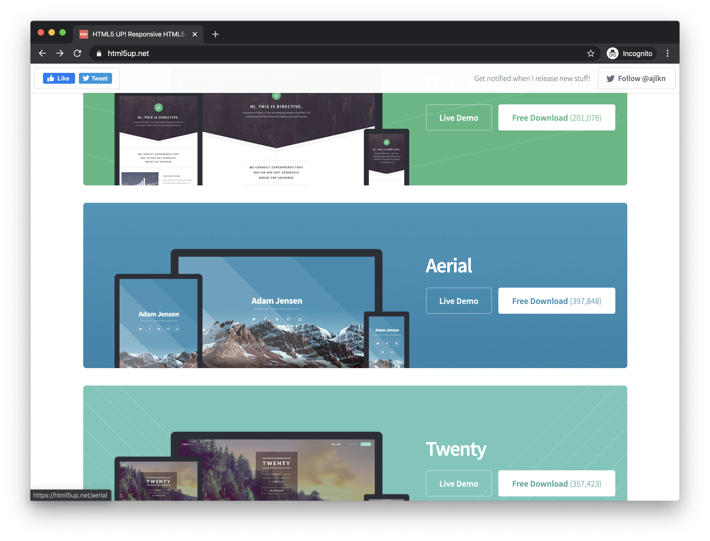

If you already know a bit of HTML, though, feel free to take a look at some of the other templates available, too.

> The next two parts of this tutorial give a quick beginner's overview of HTML and CSS, two languages which are used to create website layouts and style them. I reference very specific parts of the Aerial template code (like line numbers), so if you're just starting out and want to follow along as closely as possible, download [Aerial](https://html5up.net/aerial).

Regardless, once you've made your choice, click "Free Download". You should see a .zip file pop up in your downloads. This file contains all of the template code, but [compressed](http://www.piedpiper.com/) to save bandwidth and make the download faster.

To use the template, you'll need to unzip it: double-click the downloaded file (you might also have to click "Extract").

Once the files are unzipped, you're ready to start digging into the HTML.

## HTML

First, I recommend moving the template folder out of your Downloads and into your Documents or Desktop, so you don't accidentally delete your work when if you ever clean out your Downloads.

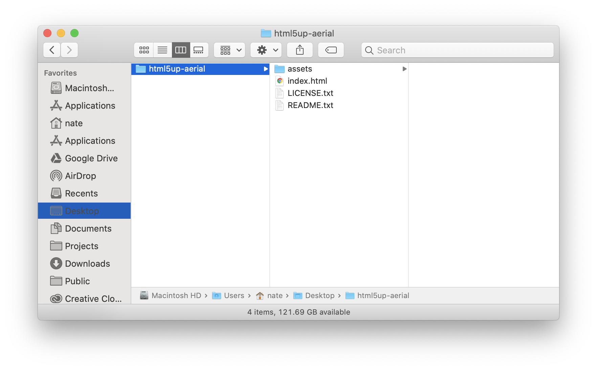

Double-click the `index.html` file to open it in your default web browser.


You should see the template filled in with some placeholder content about a guy named [Adam Jensen](<https://en.wikipedia.org/wiki/Adam_Jensen_(Deus_Ex)>) — keep this browser window open.

Now, go back to your file manager and right-click on `index.html`. This time, open `index.html` with a text editor. On macOS, this will likely be [TextEdit](https://en.wikipedia.org/wiki/TextEdit), and on Windows, you'll want to use [Notepad](https://en.wikipedia.org/wiki/Microsoft_Notepad).

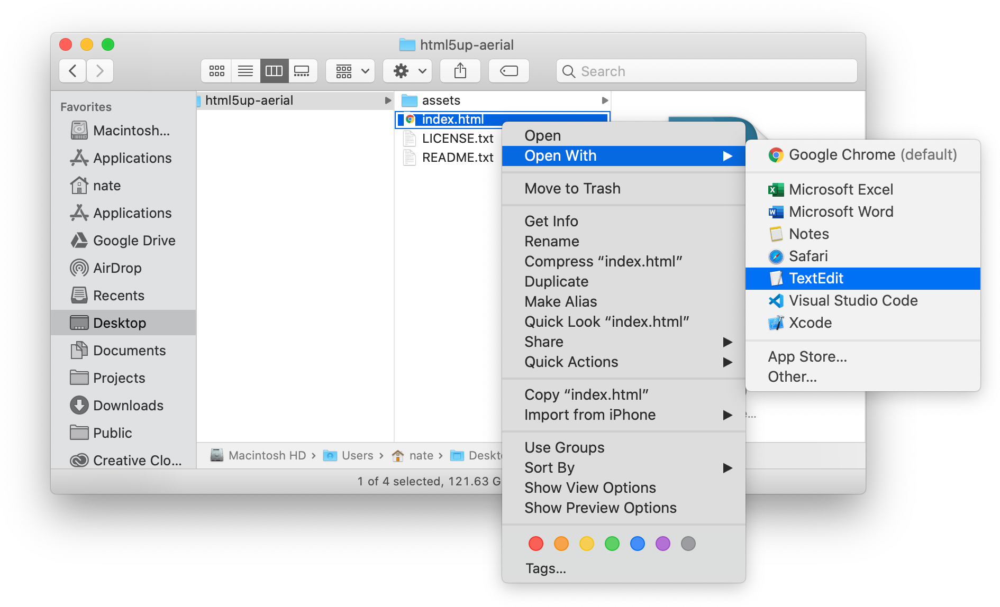

If you don't see Notepad or TextEdit in the "Open With" window, you need to open Notepad or TextEdit through the start menu (Ctrl + Windows) or spotlight (Command + Space), and then open the `index.html` file by clicking ["File" then "Open"](https://support.apple.com/guide/textedit/open-documents-txte51413d09/mac) (Ctrl + O).

On macOS, you might not see code immediately (it should be black and white text), but instead some color and different font sizes instead (i.e. formatted text).

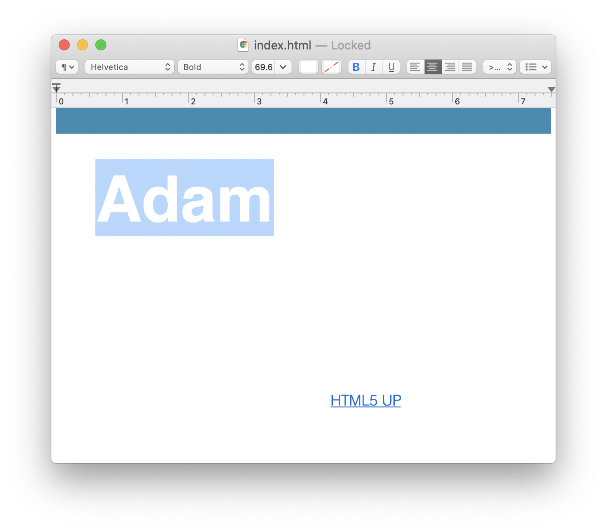

If so, you'll need to change your TextEdit preferences.

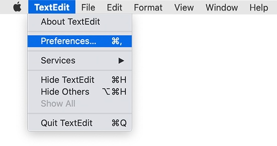

Check the "Display HTML files as HTML code instead of formatted text" option.

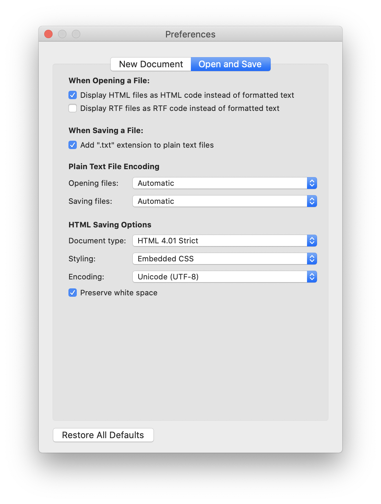

Next, close the Preferences window and quit TextEdit. Then, repeat the steps above (right click on `index.html`, hover over the "Open With" option, click "TextEdit").

You should see HTML code: this turns into the blue and white website about "Adam Jensen" you saw earlier in your browser.

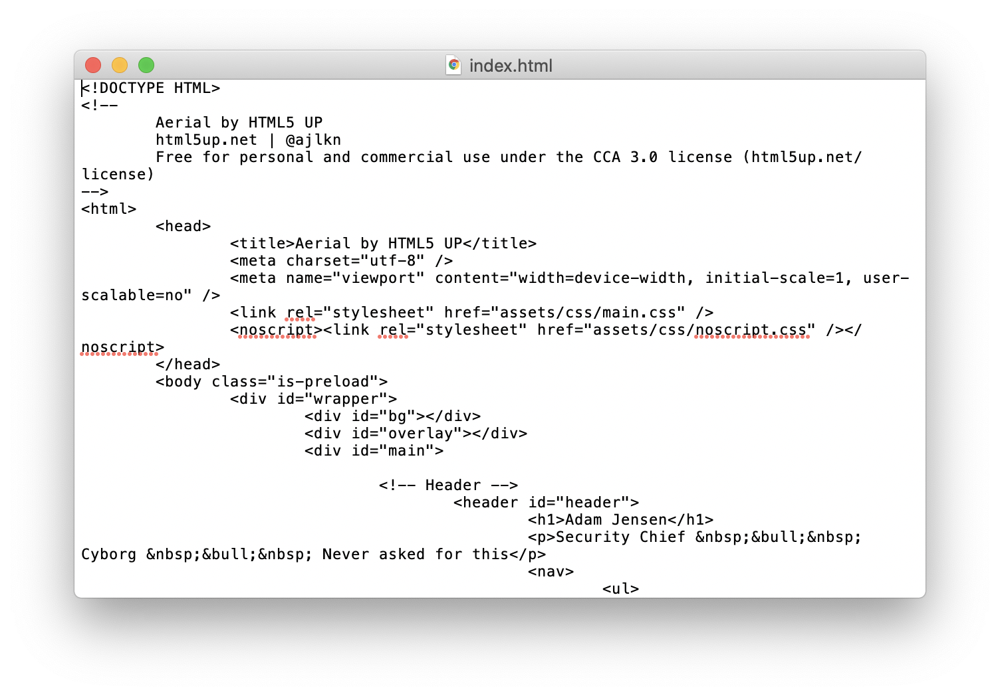

Let's get coding! First, change the text in between `<title>` and `</title>` (`Aerial by HTML5 UP`) to your name.

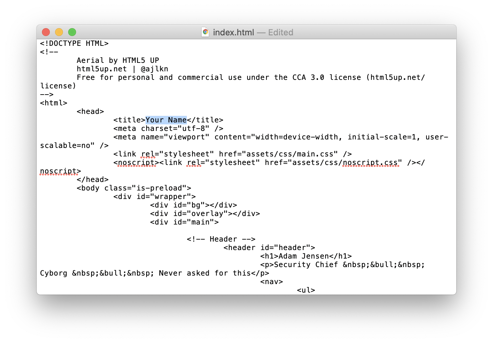

Next, do the same with the text between the `<h1>` and the `</h1>` (`Adam Jensen`).


Then, hit save (Ctrl + S) and go back to the browser window you opened earlier with the HTML file. Refresh the page, and you should see your changes!


The text you changed between the `<title>` and `</title>` now shows up in the tab title (in the image above, look in the upper left -- if you have a lot of tabs open and the titles are hidden, maybe open a new window).

The text you changed between the `<h1>` and `</h1>` now shows up as the big white text in the center of the page (`h1` stands for "heading 1", and it's the biggest heading available in HTML — [it goes all the way down to heading 6, or `h6`](https://www.w3.org/MarkUp/html3/headings.html)).

One thing you might notice about the code we're editing is that it's really difficult to see what's going on in the black and white expanse.

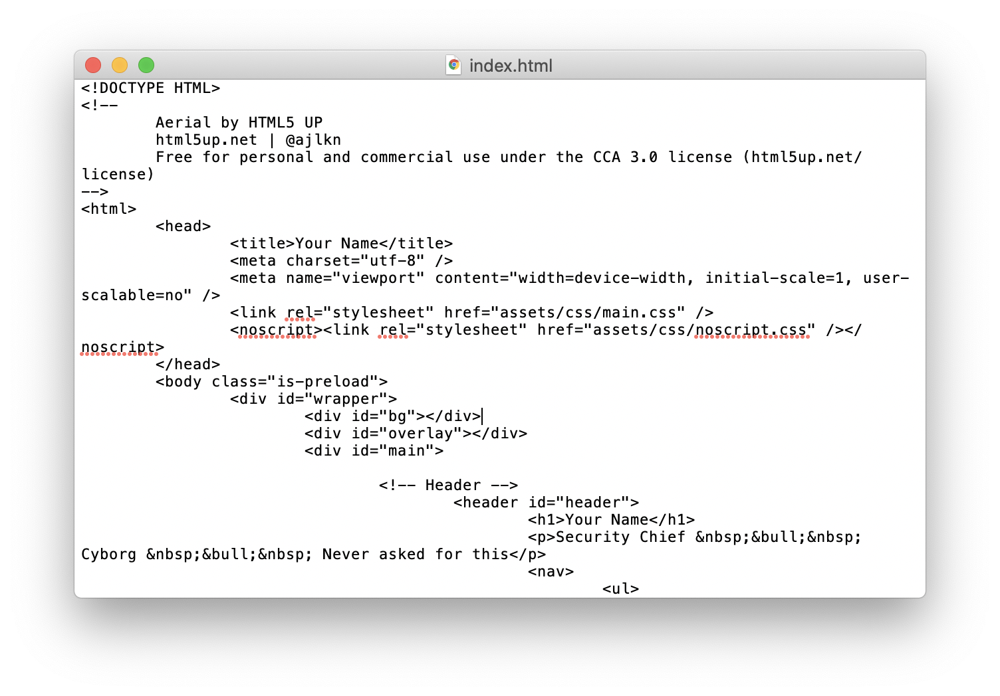

If you right click anywhere on the rendered blue and white page in the browser with our HTML file and hit "Inspect" again, you'll see that our browser helpfully highlights our source code — in the image below, actual text that is shown on-screen is black, and the `<`, `>`, and `/` which aren't shown on screen are purple (comments, which are never shown and are just notes to yourself so you know what you were thinking when you were writing the code, are green).

The colors might be a little different if you're using a different browser or are in dark mode (where, for instance, the text shown on-screen might be white instead of black), but the idea is the same.

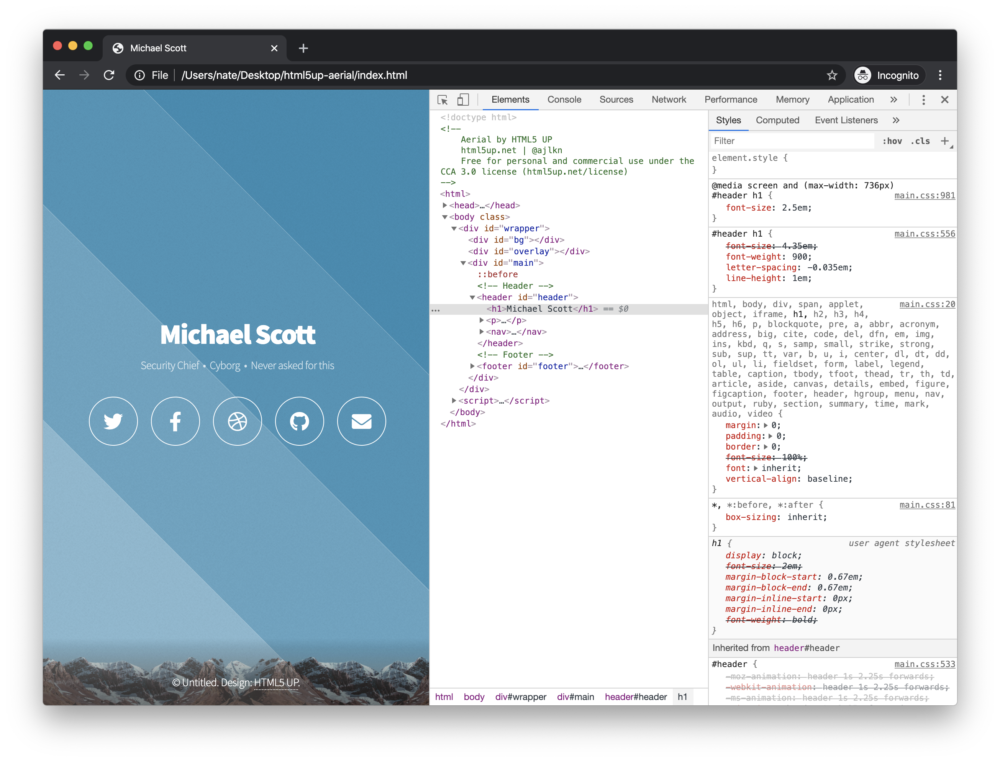

This is called syntax highlighting, and it helps prevent mistakes — when you see a new color in a place you don't expect, you'll know to stop and think before typing more.

There are a few tools (called "editors") that offer syntax highlighting (among many other features that make it easier to write code), and you may have heard of a few — [Notepad++](https://notepad-plus-plus.org/), [Atom](https://atom.io/), and [VSCode](https://code.visualstudio.com/) are some big names. I've used all three, beginning with Notepad++, and I currently use VSCode.

They're all broadly similar, but for the purposes of following along, I suggest you download VSCode at [https://code.visualstudio.com/](https://code.visualstudio.com/).

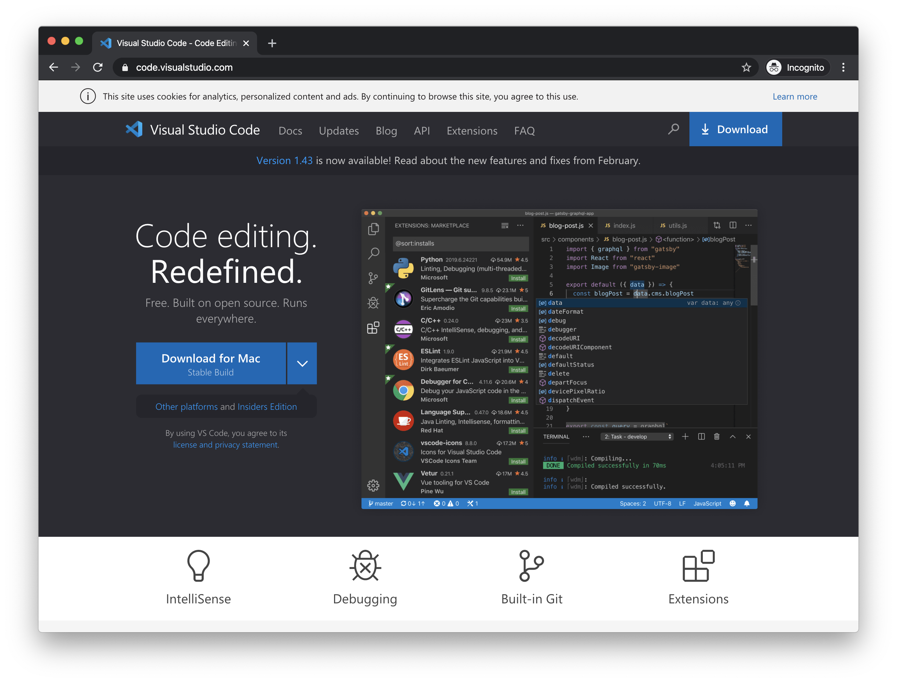

Once it's downloaded, unzip it and install it (on Mac, you'll need to move it to your "Applications" folder). Then, open the editor.

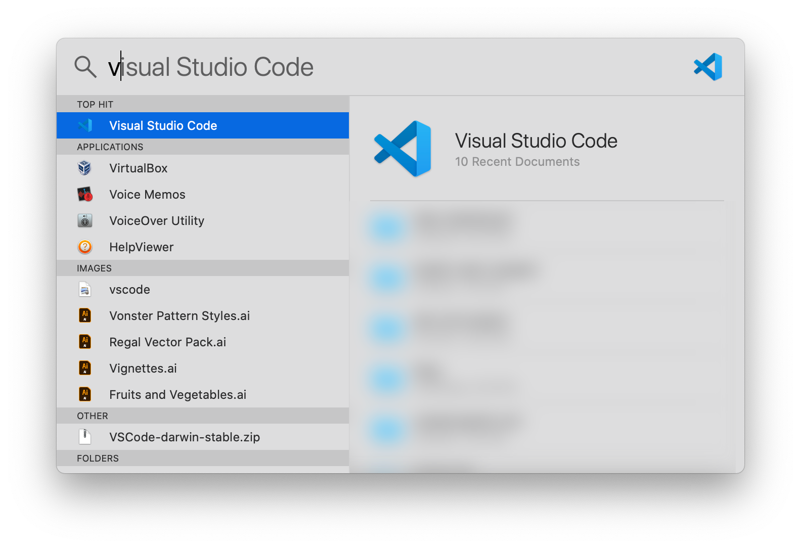

You'll see the VSCode "Welcome" screen.

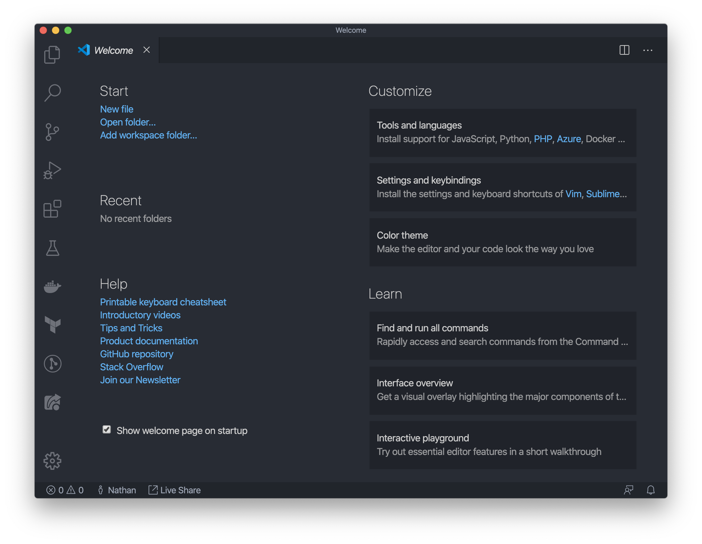

Click "Open Folder" in the top left, and then select the folder (_not_ the `index.html` file itself) containing your HTML (it's probably called `html5up-aerial`, in your `Documents` or `Desktop` if you moved it).


Once the folder is opened, you'll see the list of files in it in the left sidebar. Click `index.html`.


Now, our code is all pretty and highlighted! Editing it should be much clearer: for now, you generally only want to change the white text in between the `>` and `<`. That'll directly change the text displayed on screen.

At the very least, let's get the content of the site minimally changed so it's fully customized (we'll remove all the "Adam Jensen" stuff) so you can upload the site and send it to your friends.

We still need to change the subtitle ("Security Chief • Cyborg • Never asked for this"), the social links, and the copyright at the bottom.


First, let's change the subtitle. You've probably already found it — it's the text between `<p>` and `</p>` right under the `<h1>` and `</h1>` where you added your name earlier (the `Security Chief &nbsp;&bull;&nbsp; Cyborg &nbsp;&bull;&nbsp; Never asked for this` text — the `&nbsp;` creates a [special type of space](https://en.wikipedia.org/wiki/Non-breaking_space), and `&bull;` creates a bullet point; even though they are a different color than the normal text in the editor, they are safe to delete along with the rest of the text). The `p` stands for paragraph, and it's generally used for displaying blocks of text.

Change the subtitle to something that suits you — if you have a [LinkedIn profile](https://www.linkedin.com/in/nathanhleung/), that'd be a good place to put your headline.

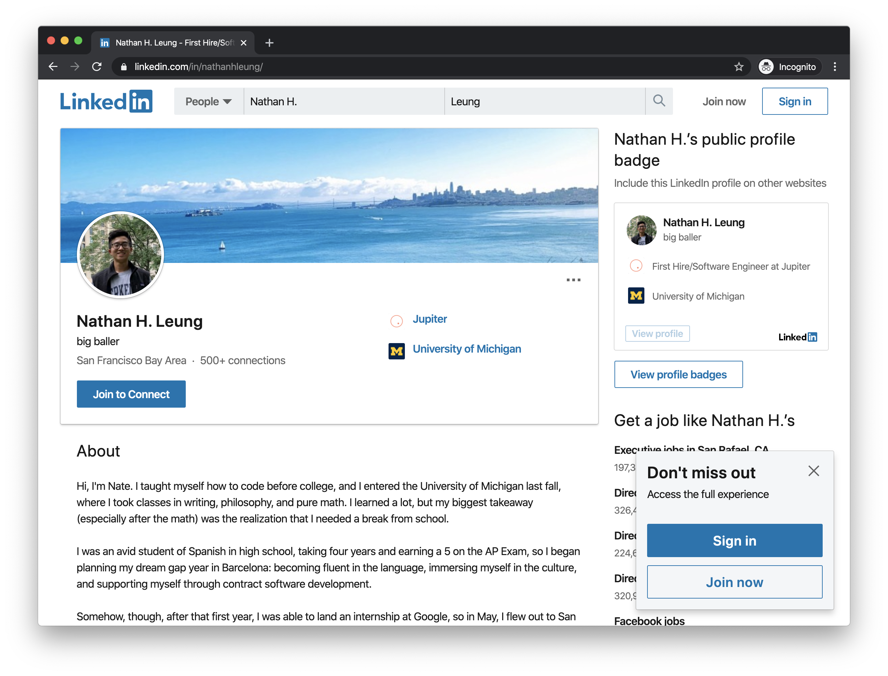

After changing it, save the file (Ctrl + S) and then refresh the window again. You should see the new subtitle immediately.


Next up, you'll want to change the social links.

Another important feature of an editor like VSCode is the line numbering (so we can now talk precisely about the location of our edits in the HTML code) — you'll be able to find the social link code between lines 27 and 31:

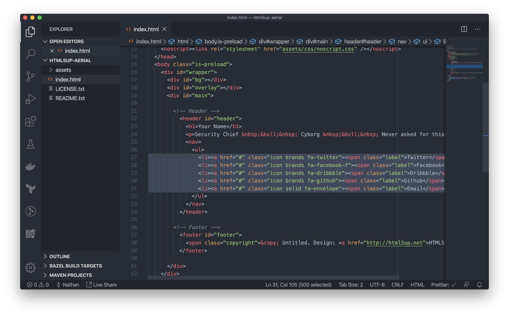

To change where the links go, you'll need to change the green text right after `href` (keep the quotations). If you don't have a certain social account (for instance, if you don't have a [Dribbble](https://dribbble.com/)), just delete the line.

You can think of `href` as meaning "to" — it specifies where the link is going. It's short for "hypertext reference" — "hypertext" is ["text which contains links to other texts"](https://www.w3.org/WhatIs.html) and a "hypertext reference" is a "reference" (i.e. a link) to another page of "hypertext."

Taking another step back, [HTML stands for](https://www.fastcompany.com/3046707/how-to-meet-ladies-decoding-silicon-valley-character-erlich-bachmans-look) "hypertext markup language" (it's a way of telling the browser how hypertext should be "marked up," or displayed). You are writing hypertext!

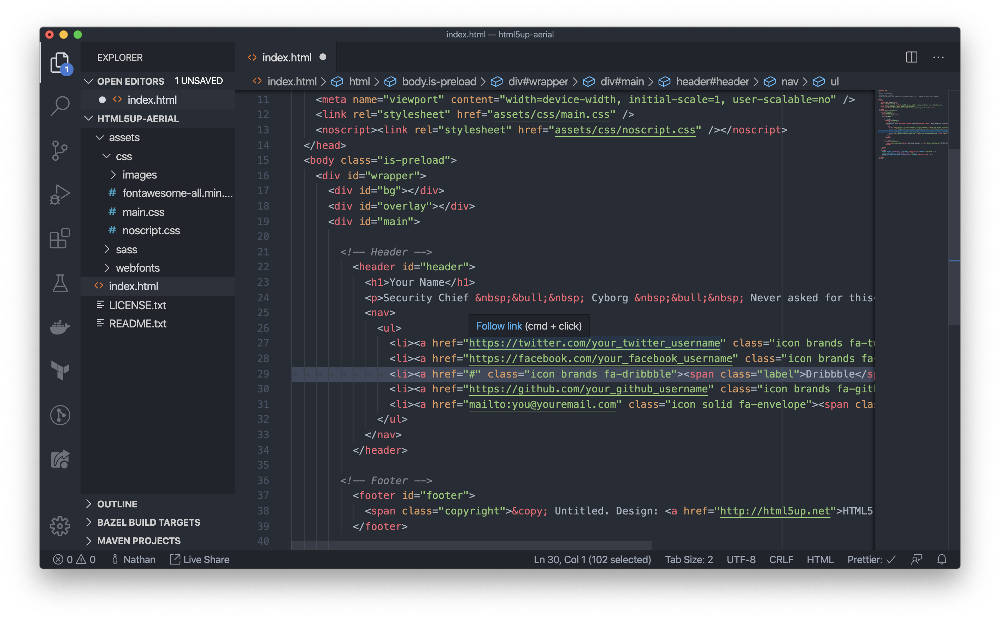

Make sure to include `http` or `https` in each link to another website, and if you want to link to an email address, [prepend it with `mailto`](<(https://css-tricks.com/snippets/html/mailto-links/)>) as in `mailto:youremail@email.com`. After changing the `href` of each link, save, go back to your browser, and refresh.


If you hover over you each link and (on Chrome, at least) look at the lower left-hand corner, you should see that all the links are updated.

You might be curious about why there's text in each social link that's not shown — for instance, `Twitter` between the `<span class="label">` and `</span>` below:

```html
<li>
  <a
    href="https://twitter.com/your_twitter_username"
    class="icon brands fa-twitter"
  >
    <span class="label">Twitter</span>
  </a>
</li>
```

The text is hidden, but it's there for [accessibility](https://www.w3.org/WAI/fundamentals/accessibility-intro/) purposes — if a visually impaired user is using a [screenreader](https://developer.mozilla.org/en-US/docs/Learn/Tools_and_testing/Cross_browser_testing/Accessibility#Screenreaders) to browse your site (and hence won't be able to see the Twitter logo), the screenreader will be able to read "Twitter" aloud so the user knows where the link goes.

How is the link hidden? The answer is CSS.

## CSS

On the left-hand side of VSCode, if you click `assets` then `css` then `main.css`, you'll see the stylesheets associated with the template — these files define the styles (colors, font sizes, etc.) applied to your HTML.

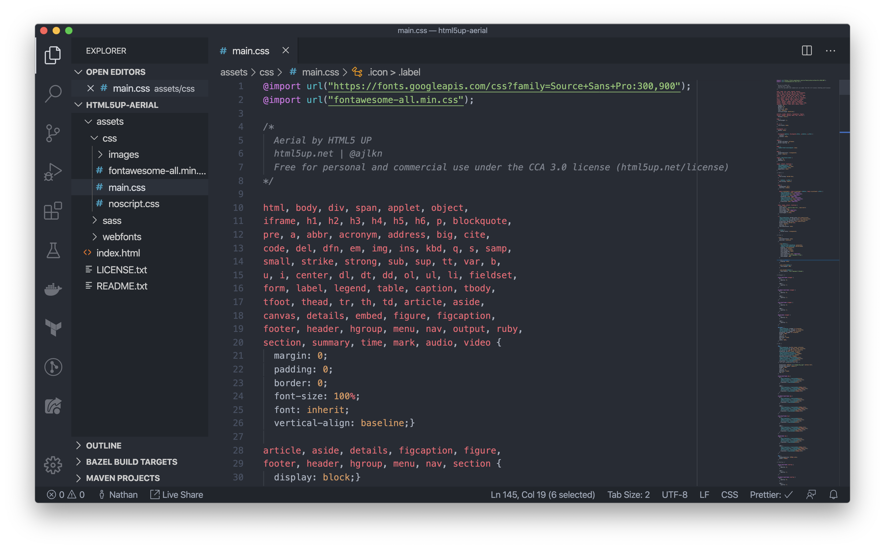

Press Ctrl + F (this lets you do an arbitrary text search across an entire file), and search for `.label`.

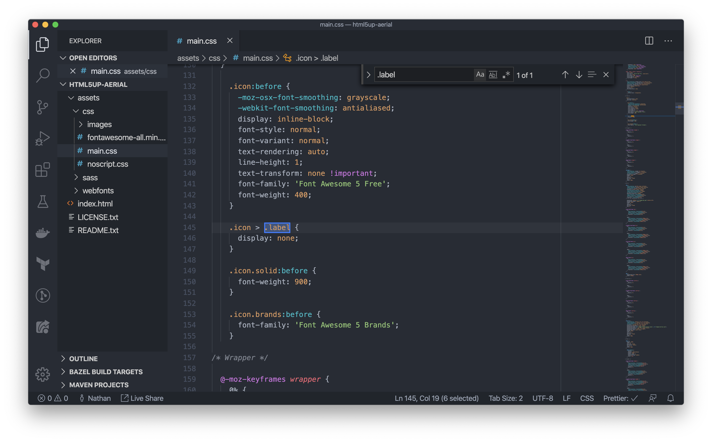

The `display: none` in line 146 tells the browser not to show the "Twitter" label we saw above — that's why even though the text is white in the editor, we don't see it in the resulting page.

While we're in `main.css`, scroll to line 214. Here, you can see all the styles applied to the background of the page. On line 229, you can change the background color of the whole page.

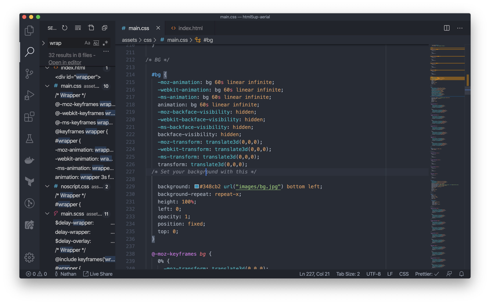

In your browser, go to Google and [search for "hex color picker."](https://lmgtfy.com/?q=hex+color+picker) You should see a color picker pop up that you can choose a new color from.

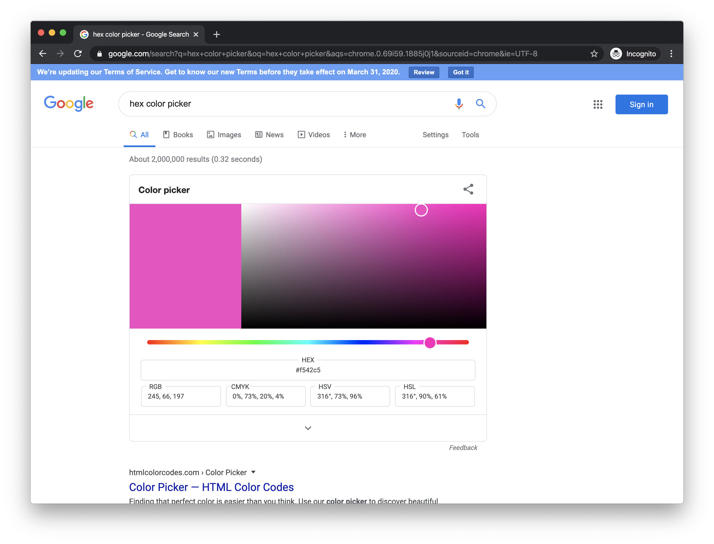

Pick your favorite color, and then copy the hex code (it's in the top box, right under the palette, containing the hashtag followed by 6 letters and numbers) and replace the background on line 229 (the entire part between the colon and the semicolon — the final result should not contain `url`, `bottom`, or `left`).

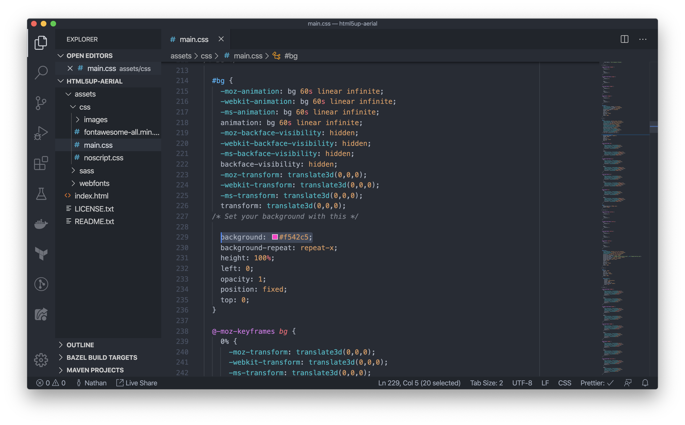

Save, and then go back to the HTML file in your browser and refresh.

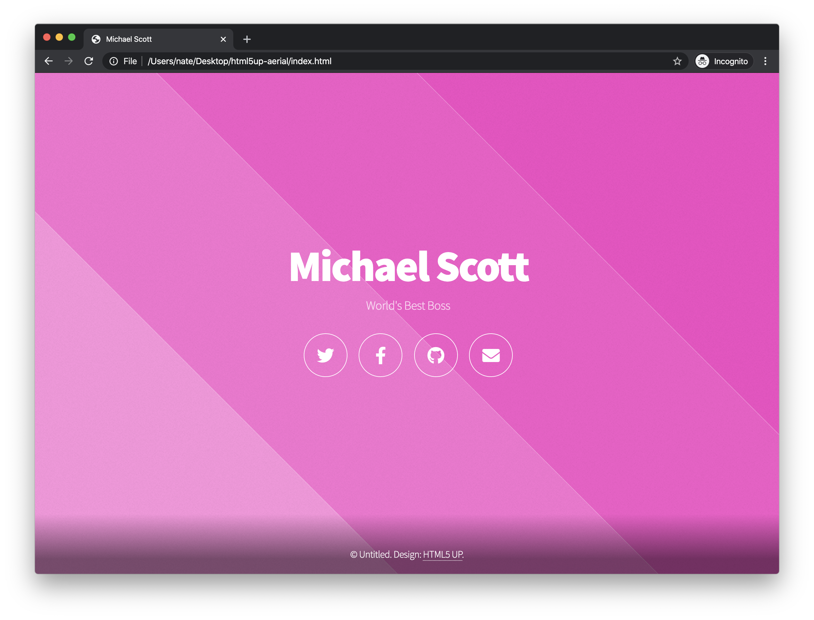

Now, all that's left for a [minimum viable website](https://en.wikipedia.org/wiki/Minimum_viable_product) is to update the copyright footer at the bottom with your name (to be fair, a minimum viable website could just be a blank page, but we're going for something presentable).

Before you go ahead and edit the HTML to do so, please read this next section.

## Open Source Licensing

If you remember what HTML5 UP's website looked like, you'll notice that in the top right it says the templates are "100% Free" — "under the Creative Commons." That last bit is important.


These templates are free _as long as_ you adhere to the terms of the Creative Commons License.

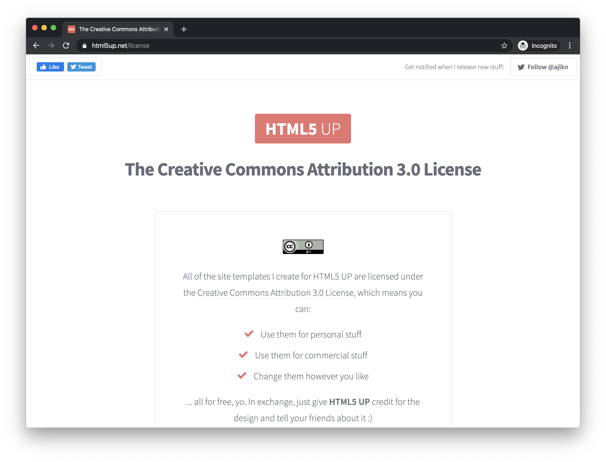

That is, you can use the template however you like as long as you keep HTML5 UP's credit in the copyright footer.

So, change the footer on line 37 to your name, making sure to leave the HTML5UP branding reading "Design: HTML5UP":

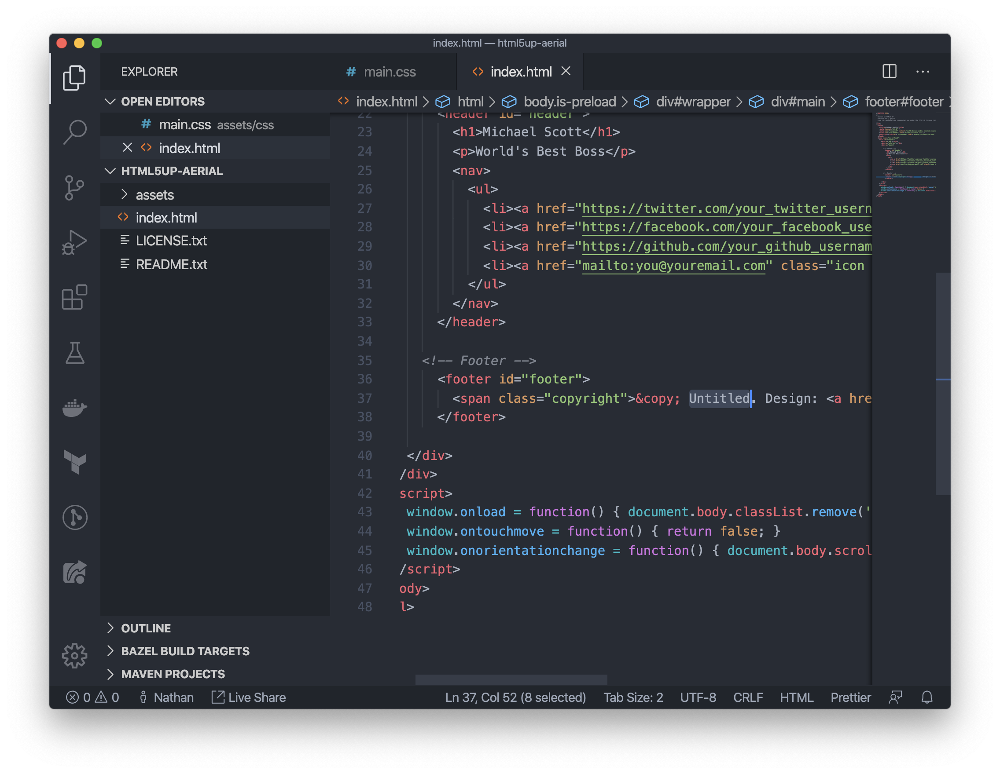

Licenses like the Creative Commons are common in the world of [free and open-source software](https://en.wikipedia.org/wiki/Free_and_open-source_software) (which this template is a part of), and there are quite a few that you might see in the wild, such as the MIT license — where you can do pretty much [whatever you want](https://tldrlegal.com/license/mit-license) (including keep your code secret) as long as long as you include a copy of the license in your source code; and the [GPL license](<https://tldrlegal.com/license/gnu-general-public-license-v3-(gpl-3)>) — where any changes you make to the code have to also be made open source (i.e. public).

Some people complain, but it's completely reasonable — this software is given out for free, and is often the result of hours and hours of work. The least we can do is respect its creators' wishes — [open source is often thankless work](https://techcrunch.com/2018/06/23/open-source-sustainability/).

Even better, as you get better at HTML, maybe you'll be able to design your own templates and give back to the community yourself.

But in the meantime, you've got a website that's ready to be put online:

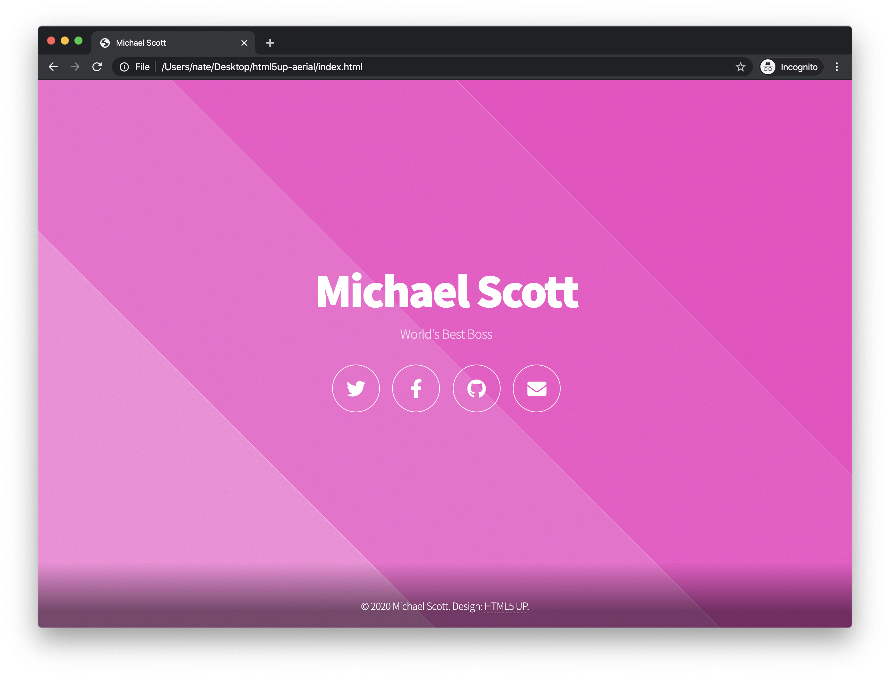

Also — this has just a been basic intro to HTML, but if you want to learn more, there are a bunch of great free online resources I recommend: [Codecademy](https://www.codecademy.com/), [FreeCodeCamp](https://www.freecodecamp.org/), [w3schools](https://www.w3schools.com/) (yes, [even w3schools](https://www.w3fools.com/)), and straight Google ("how to change the font on a website") to name a few. These resources can teach you how to add animations, change text formatting, create complex gradients, and more.

For now, though, let's put this site on the internet.

## Upload to the Internet

We'll use [Netlify](https://www.netlify.com/), a platform for deploying modern web projects, to upload the site. First, create an account at [netlify.com](https://www.netlify.com/).

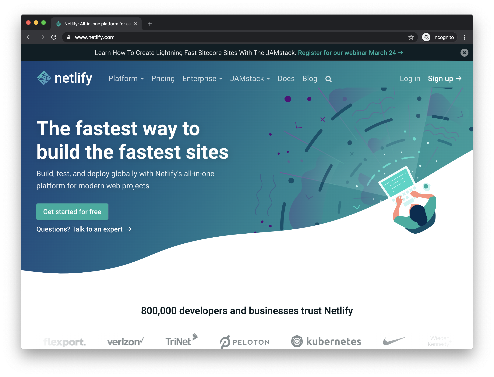

Sign up with your email.

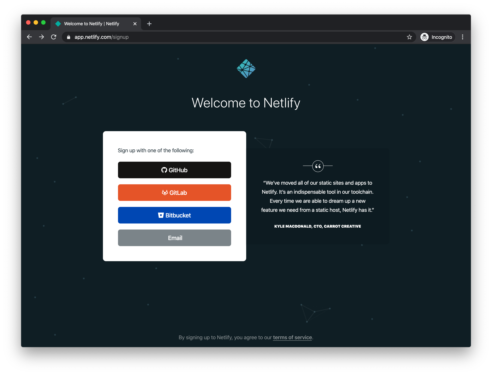

After confirming your email, you should see a screen similar to this one:

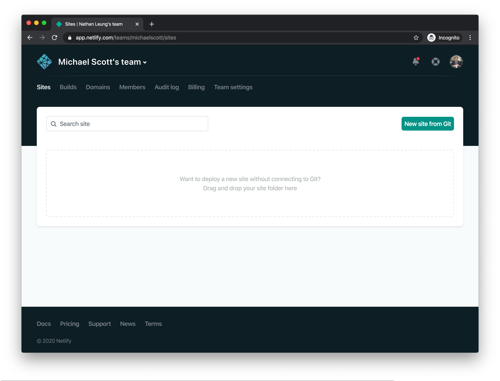

Now, drag and drop your site folder onto the dotted rectangle, and Netlify will automatically upload your site. You'll see something like this, except with less info:

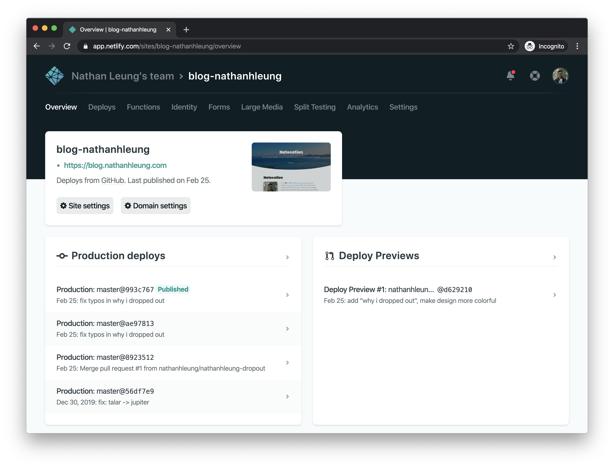

Netlify will first upload your website to their main server, and then they will distribute it all over the world to their other servers in [Europe, Asia, SF, NYC, and various other locations](https://community.netlify.com/t/is-there-a-list-of-where-netlifys-cdn-pops-are-located/855). When a visitor navigates to your site, they'll be automatically sent to the closest available server. Netlify also has the resources to handle millions of visitors if your site becomes super popular, and they'll encrypt traffic to your website with HTTPS.

Before Netlify, you'd have to buy a Linux web hosting subscription, set up a web server (like [Apache](https://httpd.apache.org/) or [NGINX](https://www.nginx.com/)) to send your files, and then buy an SSL certificate to encrypt your traffic. That's even before beginning to think about considerations of scale and geographic location. Netlify does this all, for the low, low price of free. It's pretty amazing.

It's important to note that your site is what's called ["static."](https://en.wikipedia.org/wiki/Static_web_page) It's got no backend — users can't enter data or log in or out of your site and expect that state to be saved if they visit your site again. The reason Netlify can offer their service for free is because it's become really, really cheap to send the same, static, unchanging files over and over again. Netlify can also compress that file (and since the original file stays the same, the compressed result stays the same, so it only needs to be compressed once, saving compute power) to save even more money.

Even though it's cheap, it still costs _something_, and you may be wondering how Netlify makes money. They're [loss leading](https://en.wikipedia.org/wiki/Loss_leader). Essentially, they hope that people like you and I sign up and really like the free plan. They also hope that we work for a big company and advocate for our company to use the product. Netlify's [paid plans](https://www.netlify.com/pricing/) offer a lot of features important to big companies — like team accounts, password-protected sites, and single-sign on. Their enterprise contracts likely [more than make up](https://techcrunch.com/2020/03/04/netfily-nabs-53m-series-c-as-micro-services-approach-to-web-development-grows/) for the free service they're providing to us.

From personal experience, their strategy seems to be working — I use Netlify [at work](https://app.jupiter.co/), and while we haven't had to upgrade to a paid plan yet, we probably will soon as we host more and more websites on the platform.

Regardless, you should now be able to visit your site at [[some string of text].netlify.com (like brave-curie-671954.netlify.com)](https://docs.netlify.com/domains-https/custom-domains/). Take a look! That's your site — you can send that to your friends and family anywhere else in the world, and they'll be able to see it too. Now, you just need your own personal domain.

## Buy a Domain

This is the only part of this that costs money — at most \$12/year, or \$1/month. That is, you can buy 10 domains for the cost of your Netflix subscription. Not a bad deal at all.

A domain is the [google.com](https://google.com), [whitehouse.gov](https://www.whitehouse.gov/), [lackawannacounty.org](https://www.lackawannacounty.org/), or even [abc.xyz](https://abc.xyz/) that you see in your address bar. Domains are managed by centralized agencies — there's a [company that manages ".com"](https://en.wikipedia.org/wiki/Verisign), another [that manages ".gov"](https://home.dotgov.gov/) (that's the U.S. Government's [General Services Administration](https://www.gsa.gov/)), and more that manage ".org" and ".xyz". The text that comes after the "." is called a top-level domain — so com, gov, org, and xyz are all top-level domains.

Whenever you type a domain into your address bar (like google.com) your browser contacts a [DNS (domain name system)](https://en.wikipedia.org/wiki/Domain_Name_System) server (likely operated by your ISP, such as Comcast or Verizon) which tells it where that domain name is pointed at, which is typically an IP address{{#if ipAddress}} (fun fact: yours is [`{{ipAddress}}`](https://lmgtfy.com/?q=what+is+my+ip)){{/if}}.

Whereas "the Steamtown Mall" is like a domain name, "300 Lackawanna Ave, Scranton, PA 18503" is like an IP address. The post office needs to know the real address to send mail there, and your browser needs to know a real IP address to know where to send your request.

You have to register a domain through a company that's authorized to work with the root company that manages all registrations for a specific top-level domain (for instance, to register a ".com", you need to work with a company that's authorized to work with Verisign, the company that manages all ".com" domains — a few examples would be [GoDaddy](https://www.godaddy.com/), [Namecheap](https://www.namecheap.com/), and [Google Domains](https://domains.google/)). A company that does this is called a registrar.

When you buy a domain, the registrar will send your domain registration to the root company, and then the root company will tell the world that you own a specific domain (and once you set it, that the domain points to a specific IP address). The server run by your ISP that your browser contacts to get domain information automatically updates and will eventually get this information, and then you'll be able to type your domain into your browser and it will work.

I typically buy my domains from Namecheap — I bought my first domain from them when I was a freshman in high school since I didn't have a debit card and they accepted bitcoin. I've used GoDaddy before but their UI and support was worse in my experience, and Google Domains seems fine if you want to use them, but if you're new to this and just want to follow along, I'd recommend starting out with Namecheap.

First, search for your domain in Namecheap's search bar. "com" is the most common top-level domain, so it's usually a good place to start.

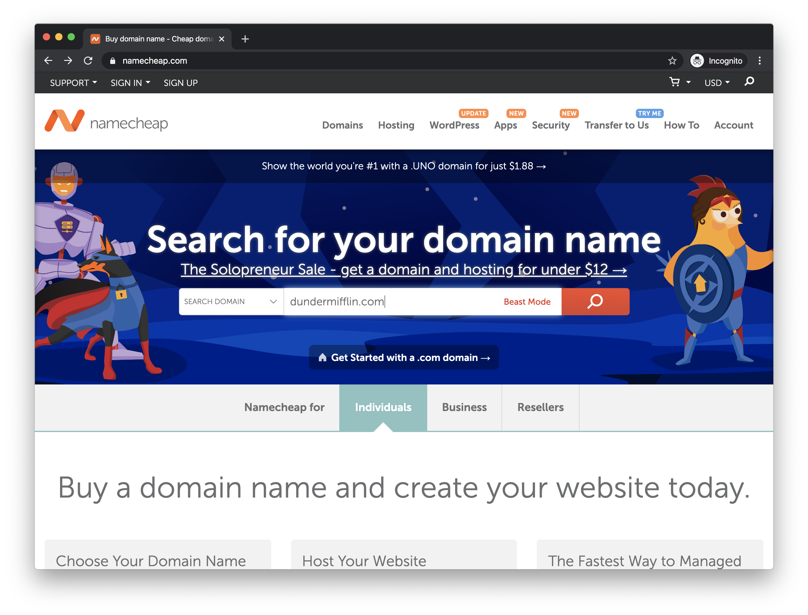

One downside of the popularity of ".com" is that the domain you want is often taken.


It's disappointing, but [domain squatting is a big business](https://en.wikipedia.org/wiki/Cybersquatting). Only one person in the world can own a specific .com, and there are people with portfolios of thousands of domains, bought at-cost for \$10 or so dollars per year, that just wait and hope for someone to roll along and want to buy a domain desperately enough that they'll [pay enough to offset their entire sunk cost](https://en.wikipedia.org/wiki/List_of_most_expensive_domain_names).

In our case, looking at other TLDs (.me and .co are pretty popular alternatives for personal websites) or searching for alternate domains is your best bet if your desired ".com" is taken (for a personal site, some alternatives to "first name last name" could be full name with middle initial, first initial last name, or just last name).

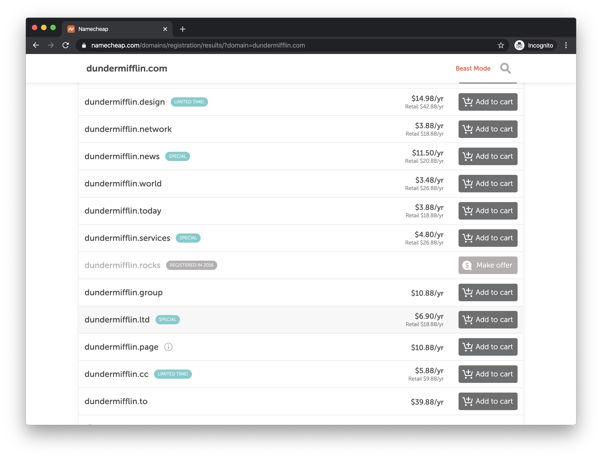

Once you've found an available domain you like, add it to your cart and then go the checkout screen. Namecheap usually has [coupon codes](https://www.namecheap.com/promos/coupons/) available that you can use to get discounted registration, so try applying one in checkout before buying. After the purchase is complete, go to your Namecheap account dashboard.

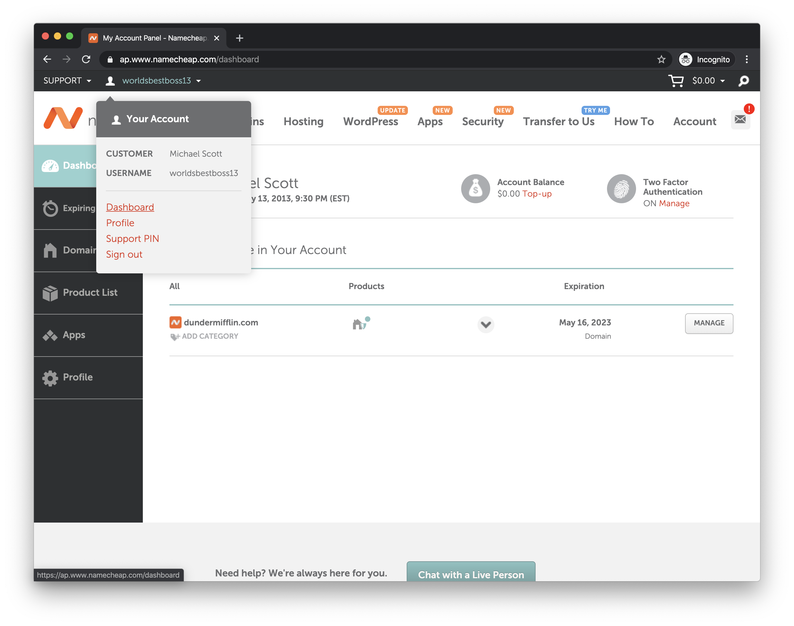

Then, click the "Manage" button to the right of your domain to open the domain management screen.

> You might have to [verify your contact info](https://www.namecheap.com/support/knowledgebase/article.aspx/9305/5/icanns-whois-verification-process) for your domain to work, and if that's the case, the "Manage" button in the image above will say "Verify Contacts". Click the down arrow on the right side of that button -- you should see a "Manage" link there instead that you can click.

> You should get an email soon from Namecheap asking you to click a link to verify your information. After you do that, you'll see "Manage" on the button as depicted above.

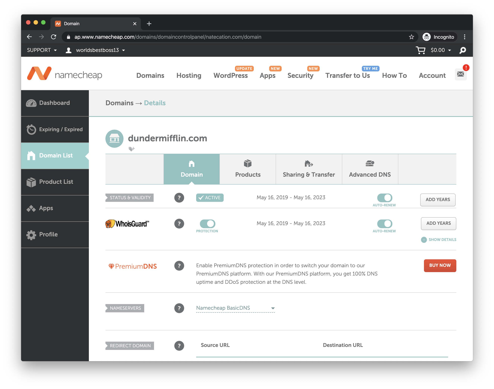

The default settings should be fine here. Next, go to "Advanced DNS" (all the way to the right).

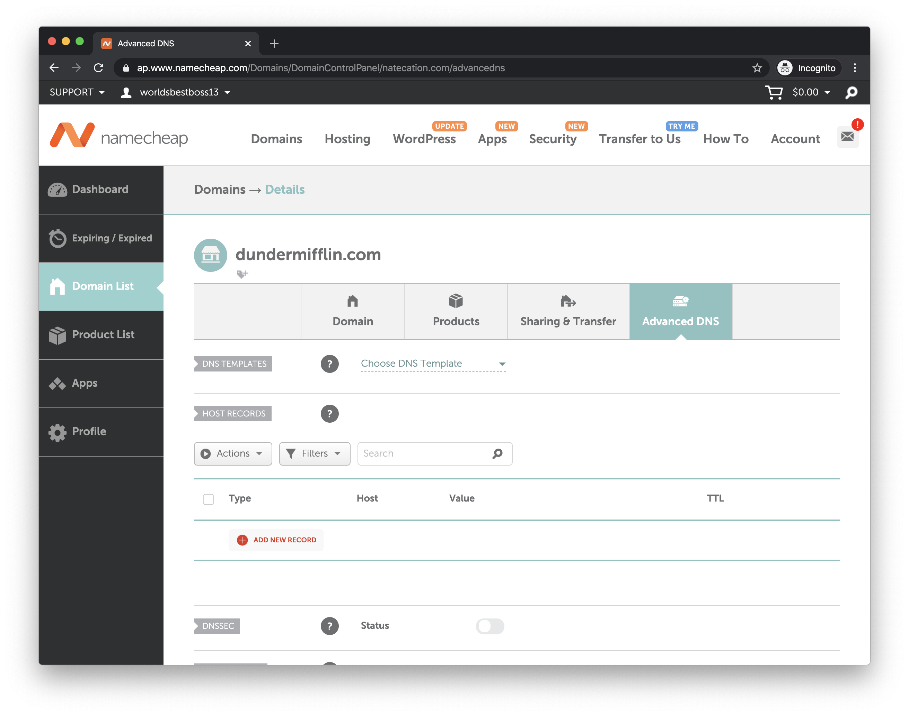

You might have a few records already in the section labeled "Host Records." Press the trash can on all of them to delete them (if the trash can doesn't work, then just start editing the records directly by clicking the text that says "A Record" or "CNAME Record" under the "Type" column).

You'll need to add the following records (or change the existing ones) to match below, making sure you change `your-site-name` to your actual Netlify site ID (keep `104.198.14.52` exactly the same):

```
A Record @ 104.198.14.52
CNAME Record www your-site-name.netlify.com
```

You should have exactly two records set once you're done.

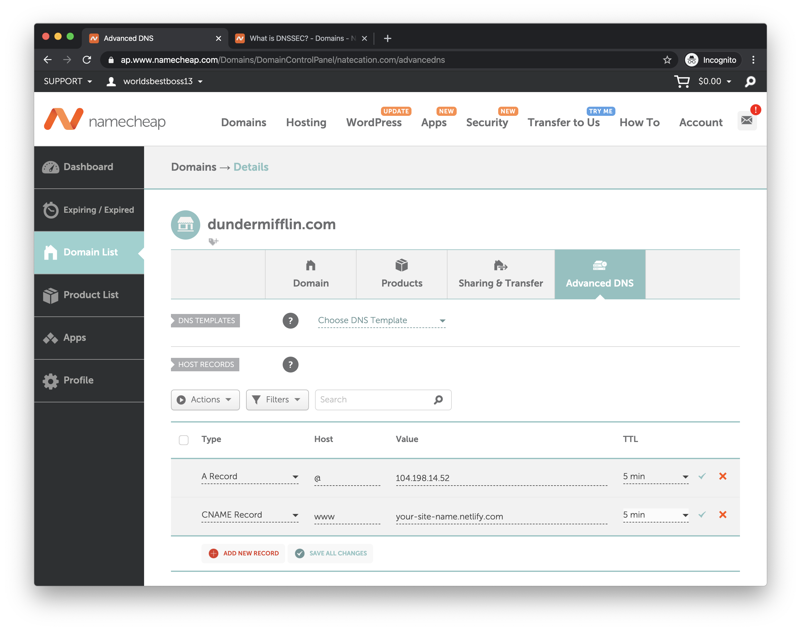

The record associated with your "naked domain" (in this example, `dundermifflin.com` without anything before of after, and denoted in DNS with the `@` sign) tells the browser the main IP address ("real address") of the domain. This record must be an A record, and A records have to be IP addresses — it's a limitation of DNS. `104.198.14.52` is the IP address of Netlify's main load balancer (which will route your request to one of Netlify's many servers that can send your website's files).

Subdomains (the `www` part of `www.dundermifflin.com`) don't have to be A records, and the CNAME here, which sets your `www` subdomain, does not have to be an IP address. In fact, this is where Netlify's magic comes in — the `your-site-name` subdomain on `netlify.com` which we're setting here is also set in Netlify's DNS, and they can set their own A record. Since we "delegate" the DNS to Netlify, Netlify can handle the logic on their end to return the IP address of the geographically closest server.

Customers accessing your naked domain will always have to send their traffic all the way to California (where `104.198.14.52` is located), but for me, `your-site-name.netlify.com` returns `104.248.63.248`, an IP address located in New York (I'm currently in Pennsylvania).

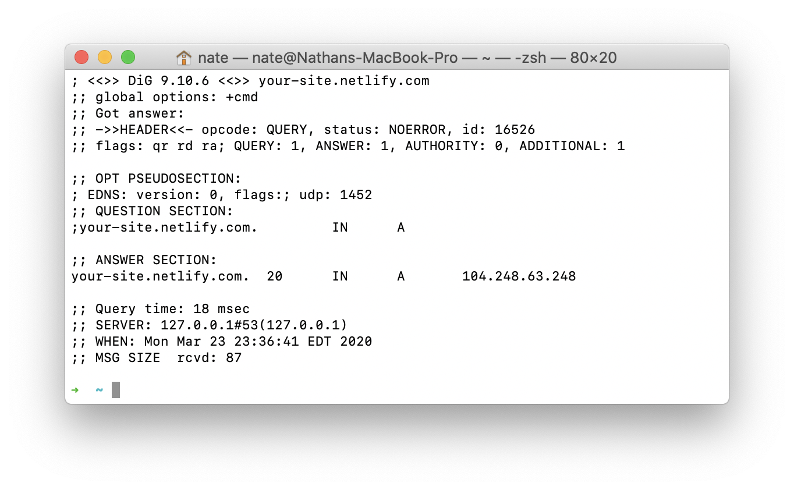

Use "5 min" for the TTL, and then make sure you save your records. After saving, when you access your domain in your browser, it might still not work, though — for a few reasons.

First, when you registered your domain, Namecheap sent your info to the centralized .com registry. If it hasn't been much time, it's likely that the centralized .com registry is still propagating the registration info to the local DNS server hosted by your ISP. It takes some time (sometimes as long as 48 hours) for that propagation to happen (ISPs have to query upstream, it's not a push mechanism), so your ISP might just not know that your domain exists. There's not much you can do other than wait.

Second, when you update your records here, your ISP's local DNS servers have to get the updated DNS info from Namecheap in a similar way and it can take a similar amount of time. This behavior, however, is controlled by the TTL — "Time to Live" — that we've set.

For efficiency, DNS servers cache records (e.g. if you updated your record five seconds ago, ISPs won't query again immediately because they can reasonably assume you haven't changed it). A five-minute time-to-live means that your record will "die" after five minutes -- that is, DNS servers will start re-querying five minutes after the last update. So the maximum amount of time you'll have to wait to see the changes in your records reflected at home should only be five minutes going forward (after the initial propagation is done).

## Attaching Your Domain

Although you've now told Namecheap to point your domain at Netlify (specifically, their main load balancer), Netlify hosts a lot of websites — you need to tell Netlify which domain is yours!

Log back into Netlify, click your site, and then hit "Settings" followed by "Domain Management" on the left.

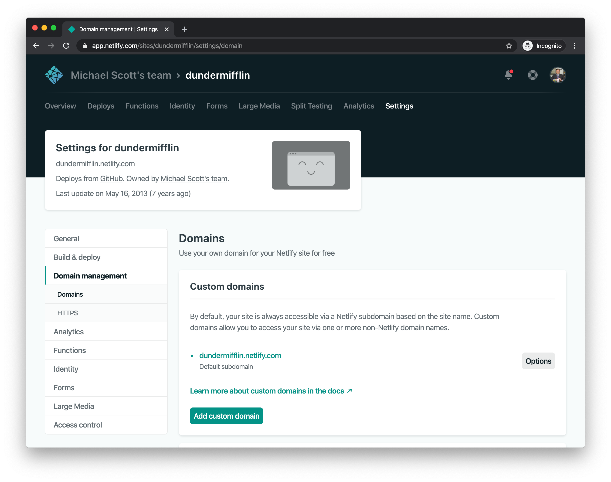

> The reason my site name doesn't look like "brave-curie-671954" is because I manually changed it to "dundermifflin". You can do the same by clicking the "Options" button to the right of your Netlify domain on this screen. If you do that, make sure to update the corresponding CNAME record in your DNS that we set in Namecheap earlier.

Then, click "Add custom domain."

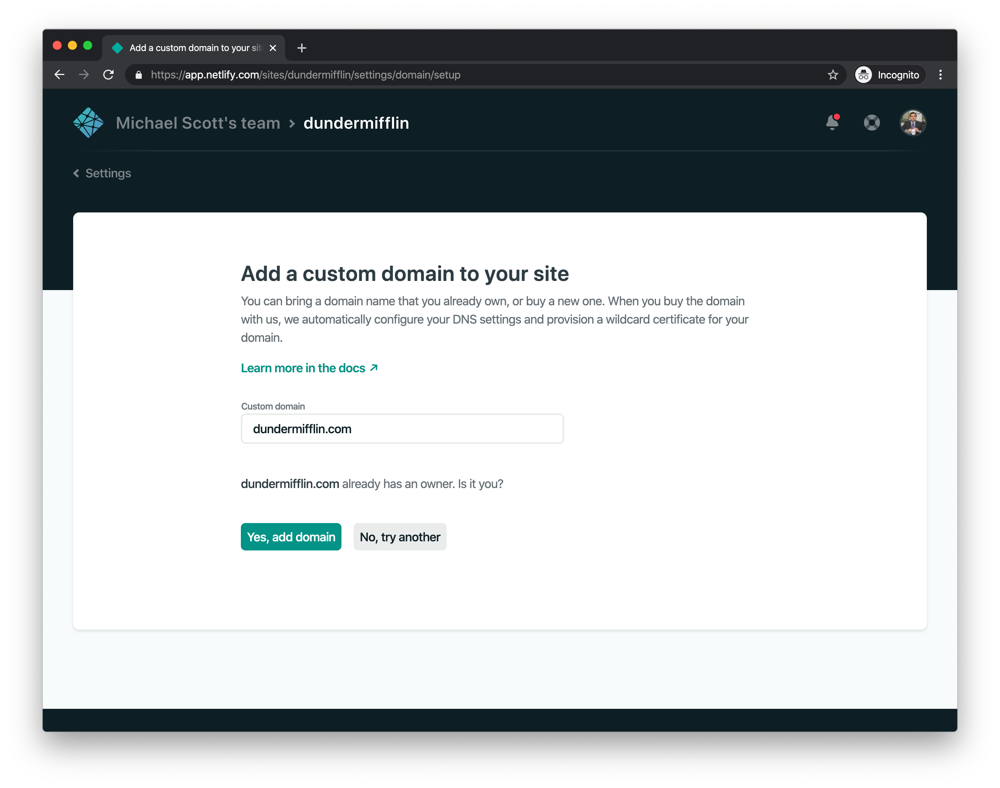

Since your domain has already been registered, Netlify will prompt you to confirm your ownership.

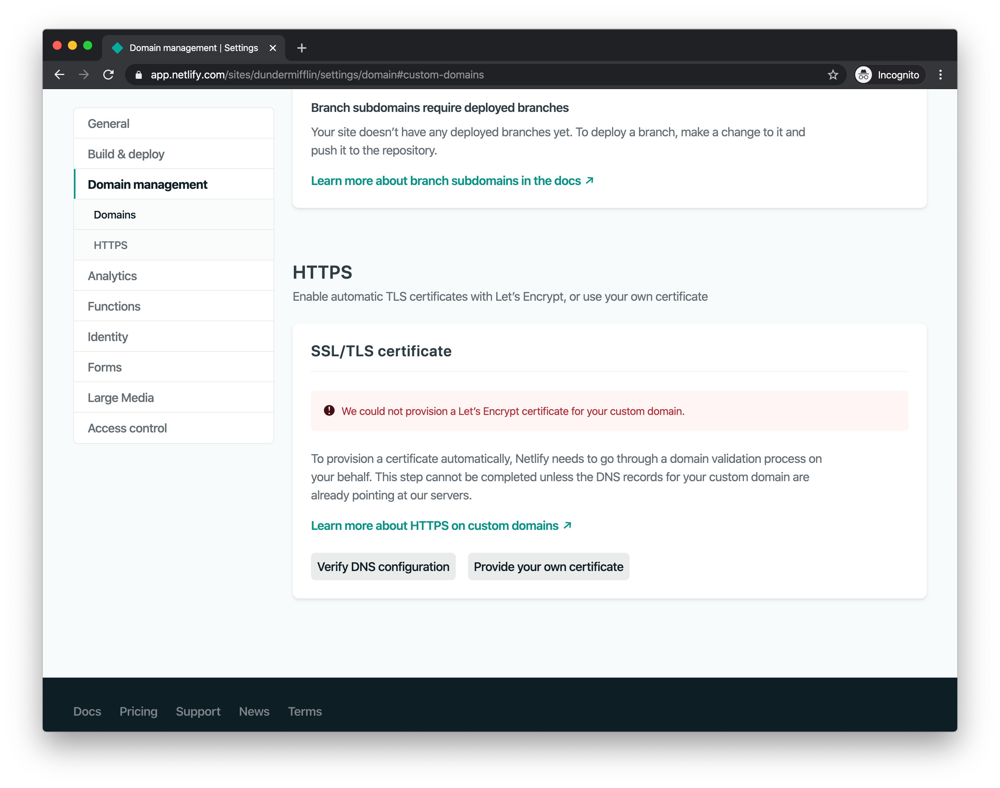

After you add the domain, to enable encrypted HTTPS connections to your site, you can scroll down and get an SSL certificate. However, these certificates depend on DNS being up-to-date (because it's how your ownership of a domain is verified — you only can create certificates for domains you own. If you created a certificate for "google.com" you could potential decrypt the HTTPS traffic of all users of Google). So you might still need to wait a bit.

At this point, all it takes is patience — everything should be ready within 48 hours.

## Afterword

Hopefully you've waited -- now visit your domain! You should see your real, working website with a professional custom domain. Throw it on your LinkedIn, Instagram bio, wherever — this is your website!

There are many like it, but this one is all yours.

### Updating Your Website

To update your website with new changes you make on your computer, log into Netlify, click your site in the "Sites" list, and then click "Deploys" in the upper left.

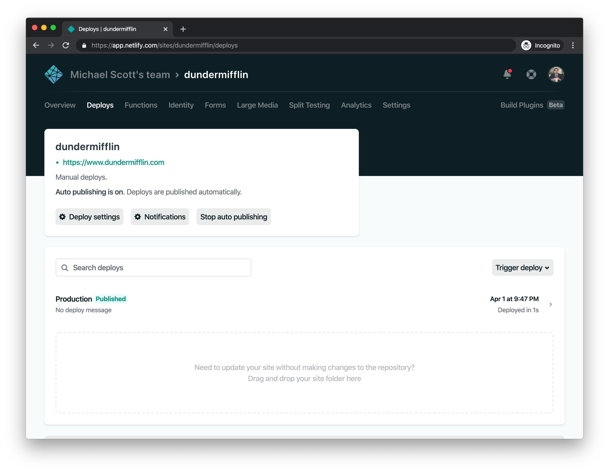

Then, drag and drop your site folder onto the dotted rectangle [just like before](#upload-to-the-internet). Netlify will take care of the rest, and your site will update in just a few moments!

### Resources to Learn More

- [Codecademy](https://www.codecademy.com/)
- [FreeCodeCamp](https://www.freecodecamp.org/)
- [w3schools](https://www.w3schools.com/)
- [Eloquent JavaScript](https://eloquentjavascript.net/) - how I initially learned JavaScript
- [Scotch.io](https://scotch.io/) - the first web application I ever wrote was a todo list tutorial from this website

> Thanks to [Alex Becker](https://alexmbecker.com/), [Sam Klugherz](https://samklugherz.com/), Albert Cai, [Jacob Cohen](http://jacobcoh.com/), and Leanne Shen for running through a draft of this -- enjoy your websites!
